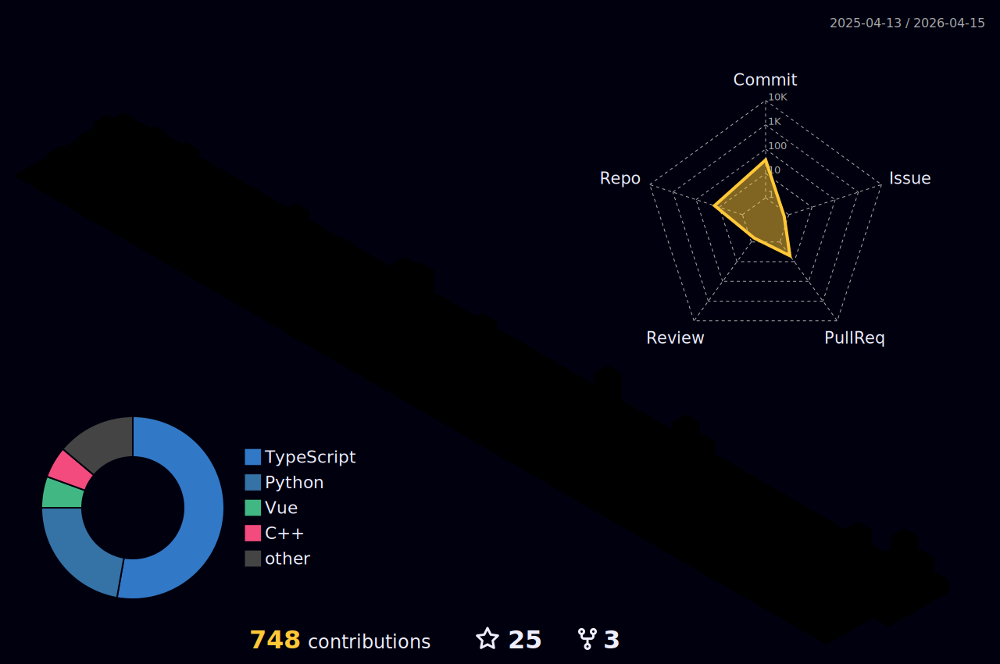

<div align="center">


[](https://git.io/typing-svg)

<p align="center">
  <a href="https://www.linkedin.com/in/richard-romero-moore-133172240/"></a>
  <a href="https://tallerhub.cl"></a>
  <a href="mailto:richard.romero@hotmail.cl"></a>
  
</p>

</div>

---

<h2 align="center">
  
  Who am I?
</h2>

I'm not a specialist — I'm a **multiplier**. I sit at the intersection of technology, product, and business. My job is to **identify real problems** and build the fastest path to a working, scalable solution.

- 🔭 Currently building: **IoT + Data pipelines for real-world business problems**
- 🚀 Role: **Innovation Lead · Product Owner · Tech Architect**
- 🌎 Based in **Chile** — building for the world
- 🧪 Prototype fast with Python + Arduino, scale with Go, deploy with Docker + Pulumi
- 💡 *"If you can only solve problems with one tool, you're the problem."*

---

<h2 align="center">
  
  Tech Arsenal
</h2>

<div align="center">

**Languages**


**Frontend & Web**


**Backend & Data**


**IoT & Hardware**


**Infrastructure & DevOps**


</div>

---

<h2 align="center">
  
  GitHub Stats
  
</h2>

<div align="center">
  
  
</div>

<div align="center">
  
</div>

---

<h2 align="center">
  
  GitHub Activity
  
</h2>

<div align="center">
  <picture>
    <source media="(prefers-color-scheme: dark)" srcset="https://raw.githubusercontent.com/CorsairRom/CorsairRom/output/github-contribution-grid-snake-dark.svg">
    <source media="(prefers-color-scheme: light)" srcset="https://raw.githubusercontent.com/CorsairRom/CorsairRom/output/github-contribution-grid-snake.svg">
    
  </picture>

  
</div>

---

<h2 align="center">🏗️ How I Work</h2>

```
Problem Discovery  →  Research & Framing  →  POC (Python + Arduino)
       ↓
Architecture Design  →  Go / Rust if perf needed
       ↓
Docker + Pulumi  →  Deploy  →  Iterate
```

---

<p align="center"><i>Based in Chile — building for the world. Let's create something together.</i></p>


