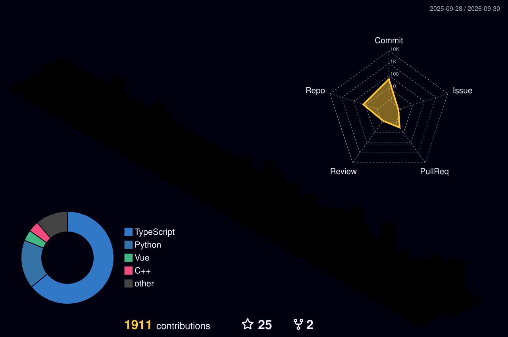
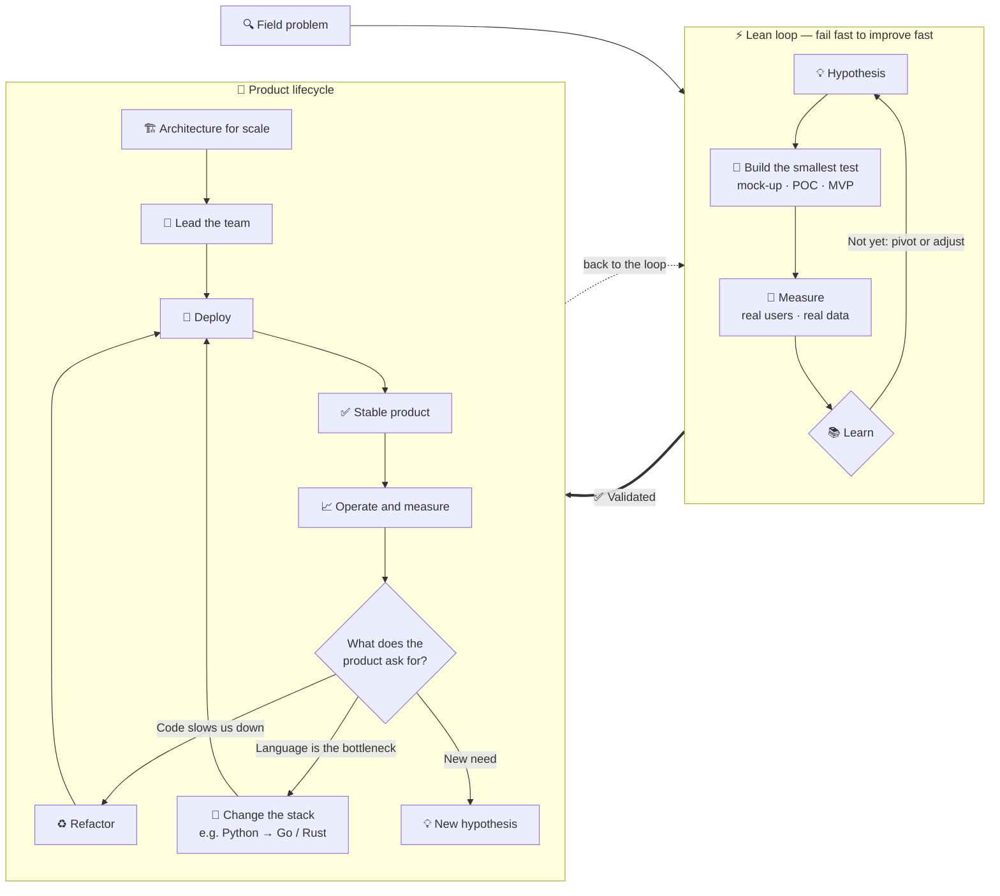

  
  
  
  

---

<h2 align="center">
  
  From mock-up to product
</h2>

I turn complex, real-world problems into **stable products** — and lead the teams that run them.

I sit where technology, operations and business meet. I go to the field, understand the problem end to end, prove a solution fast, and then take it from mock-up and proof of concept to a product that works in production every day.

- 🔍 **Understand** — model the whole system (machines, people, data, money) before writing code
- 🧪 **Prove** — prototypes and mock-ups validated with real users and real data
- 🏗️ **Build** — architecture that scales from one site to hundreds
- 👥 **Lead** — small multidisciplinary teams (software, hardware, operations) through to a stable release
- 📈 **Sustain** — support, training, documentation and a business case that keeps the product alive

**Built for:** mining · forestry · logistics & fleets · agro · manufacturing & recycling · automotive services — any operation with machines, people and data spread across the field

---

<h2 align="center">🛠️ Problems I solve</h2>

Most of this work lives in **private repositories**. Happy to walk you through any of it.

**🗂️ Operations & management systems (ERP)**
> *"Our contracts, hours and payroll live in spreadsheets, and nobody trusts the totals."*

Custom management platforms: personnel, fleet, maintenance, work orders, production and KPIs per contract — multi-client SaaS, from first mock-up to production.

**🚜 Machine telemetry & fault diagnosis**
> *"We don't know why our machines stop in the field — we find out when they're already down."*

CAN Bus / J1939 and GPS data pipelines: capture, analysis, prediction and visualization. On-machine diagnosis of conflicts between OEM equipment and third-party devices.

**📡 Data from sites with no network**
> *"Half our sites have no signal."*

Streaming data from remote field sites over LoRa, serial (RS232/RS485) bridges and satellite links — sending data and edge analysis where there is no coverage.

**🎥 Remote video & supervision**
> *"Supervisors can't be everywhere. We need to see the operation without driving out."*

Live and recorded video from machines and remote sites, including cameras behind satellite networks.

**🔐 Remote access & maintenance**
> *"Every fix means sending a technician."*

Secure VPNs to reach, configure and maintain equipment anywhere.

**⚙️ Device configuration & support automation**
> *"Every device is set up by hand, and a bricked unit means shipping it back."*

Automated fleet-wide configuration, field-support tooling and firmware recovery.

**🗺️ Geospatial & operational data**
> *"Our maps and plans are files nobody can query, and our dashboards disagree with the client's reports."*

Shapefiles, terrain models and geolocation turned into queryable data; KPI dashboards reconciled against the source of truth.

**🔄 Legacy migration & integrations**
> *"We're stuck on an old system and can't move without losing history."*

Data migration with visual mapping and dry runs, OEM API integrations and automated extraction from external sources.

**🤖 Applied AI**
> *"Users keep asking support things that are already in the manual."*

In-product assistants that answer from your own documentation, built with evaluations and usage limits.

---

<h2 align="center">🚀 Products I've created in my spare time</h2>

| Product | What it does | Status |
|---|---|---|
| [**TallerHub**](https://tallerhub.cl) | Operating system for automotive workshops: vehicle intake, photo records, work tracking and customer updates | Production · 35 workshops |
| [**StockLocal**](https://stocklocal.cl) | Real-time hyperlocal product search for neighborhood stores | Production |

---

<h2 align="center">
  
  Tech Arsenal
</h2>

<i>"If all you carry is a hammer, every screw gets expensive."</i>

**Languages**

**Frontend & Web**

**Backend & Data**

**IoT & Hardware**

**Infrastructure & DevOps**

---

<h2 align="center">
  
  GitHub Stats
  
</h2>

  
  

  

---

<h2 align="center">
  
  Contribution Graph
  
</h2>

  

---

<h2 align="center">🏗️ How I Work</h2>

**Lean Startup at the core: fail fast to improve fast.** Fast doesn't mean sloppy — it means building the smallest thing that can prove me wrong, so the failure shows up early and the next version is better.

Once an idea is validated, I run it as a product: architecture, team, release and operation — and I keep listening to it. If the code slows us down, I refactor. If the language becomes the bottleneck, I change it. If a new need appears, it goes back into the loop.

```mermaid
flowchart LR
    P["🔍 Field problem"] --> LEAN

    subgraph LEAN["⚡ Lean loop — fail fast to improve fast"]
        direction TB
        H["💡 Hypothesis"] --> B["🧪 Build the smallest test<br/>mock-up · POC · MVP"]
        B --> M["📏 Measure<br/>real users · real data"]
        M --> L{"📚 Learn"}
        L -->|"Not yet: pivot or adjust"| H
    end

    LEAN ==>|"✅ Validated"| PRODUCT

    subgraph PRODUCT["🔄 Product lifecycle"]
        direction TB
        A["🏗️ Architecture for scale"] --> T["👥 Lead the team"]
        T --> D["🚀 Deploy"]
        D --> S["✅ Stable product"]
        S --> O["📈 Operate and measure"]
        O --> Q{"What does the<br/>product ask for?"}
        Q -->|"Code slows us down"| R["♻️ Refactor"]
        Q -->|"Language is the bottleneck"| C["🔁 Change the stack<br/>e.g. Python → Go / Rust"]
        R --> D
        C --> D
        Q -->|"New need"| N["💡 New hypothesis"]
    end

    PRODUCT -.->|"back to the loop"| LEAN
```

---

<i>Based in Chile — building for the world. Got a hard problem? Let's talk.</i>

